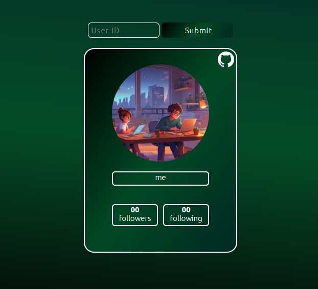

# 🌐 Web App for GitHub Data Fetching

This repository hosts a web application designed to fetch data from GitHub using API requests. Leveraging the XMLHTTPRequest method, this project offers a seamless and efficient means of retrieving relevant information from GitHub repositories. 🚀

## Features:

- **Data Fetching**: Utilizing API requests, the application swiftly retrieves data from GitHub repositories, enabling users to access a wide array of information conveniently. 📊
  
- **Customizable Requests**: Users have the flexibility to customize their requests, tailoring the data retrieval process according to their specific requirements. 🛠️

- **User-Friendly Interface**: The web application boasts an intuitive and user-friendly interface, ensuring a smooth and hassle-free experience for users. 🖥️

- **Responsive Design**: Designed to be responsive across various devices and screen sizes, the application ensures accessibility and usability for all users. 📱

## Getting Started:

To get started with the project, follow these steps:

1. Clone the repository to your local machine. 🖥️
2. Navigate to the project directory. 🗺️
3. Open the `index.html` file in your preferred web browser. 🌐
4. Begin exploring and utilizing the application to fetch data from GitHub repositories. 🚀

## Technologies Used:

- **HTML**: The structure and layout of the web application are built using HTML. 🏗️
  
- **CSS**: CSS is employed for styling and enhancing the visual appeal of the application. 🎨
  
- **JavaScript**: JavaScript is utilized to implement functionality, including API requests and data manipulation. 💻

## Contributions:

Contributions to the project are welcomed and encouraged. Whether it's bug fixes, feature enhancements, or general improvements, feel free to submit pull requests to help enhance the functionality and usability of the application. 🤝

